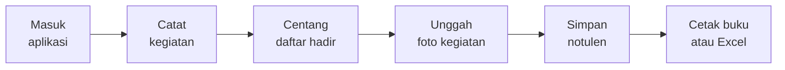

# Panduan Penggunaan Buku PKK Digital

**Untuk Sekretaris dan Kader TP PKK Kelurahan**

Kelurahan Gunung Sari Ilir · Kecamatan Balikpapan Tengah · Kota Balikpapan

Versi 1.0 · 3 Oktober 2026 · Alamat aplikasi: **https://pkk-digital.sbs**

> Dokumen ini untuk pengurus yang mengisi buku sehari-hari. **Kata sandi tidak dicetak di dokumen ini** — minta kepada pengelola aplikasi.

## 1. Apa yang berubah bagi pengurus

Sejak aplikasi ini dipakai, pekerjaan buku administrasi menjadi lebih ringkas:

- **Satu kali mencatat kegiatan, tiga buku langsung terisi**: Daftar Hadir, Buku Kegiatan, dan Notulen. Tidak perlu menyalin ulang ke buku yang berbeda.
- **Daftar hadir tidak lagi dihitung manual** — cukup mencentang peserta yang hadir saat kegiatan dibuat.
- **Buku bisa dicetak atau disimpan ke Excel kapan saja**, tanpa menyusun ulang tabel atau menghitung kolom.
- **Saldo kas dihitung otomatis** untuk uang tunai dan uang di bank, dan sisa saldo selalu terlihat di halaman kas.
- **Laporan ke PKK Kota tersusun otomatis** dari data yang sudah diisi (keanggotaan, kegiatan, surat, keuangan, inventaris, program kerja, struktur).
- **Tidak ada lagi risiko buku hilang atau satu buku tertinggal** — semua data tersimpan di satu tempat dan bisa dicetak berulang.

## 2. Cara masuk ke aplikasi

1. Buka peramban (Chrome atau lainnya), ketik alamat **https://pkk-digital.sbs**
2. Pada kolom **"Nama pengguna"**, isi nama pengguna (bukan alamat email)
3. Pada kolom **"Kata sandi"**, isi kata sandi Anda
4. Klik tombol **"Masuk"**

Setiap pengurus memakai nama pengguna sendiri agar catatan siapa mengisi apa bisa ditelusuri.

| Nama pengguna | Peran | Paling cocok dipakai untuk |
|---|---|---|
| sekretaris | Sekretaris | Mengisi hampir semua buku: anggota, surat, kegiatan, kas, inventaris, program kerja, struktur |
| kader | Kader | Mengisi daftar hadir kegiatan, mengunggah foto kegiatan, mengisi buku tamu |
| ketua | Ketua | Melihat seluruh buku dan mencetaknya (tidak mengubah data) |
| ketua-pokja | Ketua Pokja | Mengelola program kerja dan buku milik Pokjanya sendiri |
| bendahara | Bendahara | Mengisi buku kas dan tabungan |
| admin | Administrator | Mengatur akun pengguna dan data dasar kelurahan |

Catatan keamanan: bila salah kata sandi **5 kali dalam satu menit**, aplikasi menahan percobaan berikutnya sekitar satu menit. Tunggu sebentar lalu coba lagi dengan hati-hati.

## 3. Menu di sisi kiri dan tugasnya

| Menu di sisi kiri | Isinya | Sekretaris | Kader |
|---|---|---|---|
| Dashboard | Ringkasan jumlah orang, surat, kegiatan, dan Pokja | Melihat | Melihat |
| Data Anggota | Daftar anggota dan kader beserta keanggotaan Pokja | Mengisi | Melihat |
| Agenda Surat | Surat masuk dan surat keluar, disposisi, lampiran scan | Mengisi | Melihat |
| Kegiatan | Kegiatan, daftar hadir, notulen, foto kegiatan | Mengisi | Mengisi daftar hadir dan foto |
| Buku Tamu | Tamu yang datang ke sekretariat | Mengisi | Mengisi |
| Buku Kunjungan | Kunjungan PKK ke luar atau ke warga | Mengisi | Melihat |
| Kas dan Tabungan | Buku keuangan Pokja dan Buku Tabungan kelurahan | Mengisi | Tidak berhak |
| Inventaris | Daftar barang milik PKK beserta kondisinya | Mengisi | Melihat |
| Program Kerja | Program kerja unit dan matriks rencana pelaksanaan | Mengisi | Melihat |
| Struktur Pengurus | Susunan pengurus TP PKK, Pokja, dan LBS | Mengisi | Melihat |
| Laporan ke Kota | Laporan bulanan dan tahunan untuk PKK Kota | Mengisi | Melihat dan mencetak |

Bila sebuah menu tidak muncul di sisi kiri atau muncul pesan **"403"**, artinya peran Anda tidak berhak membuka halaman itu. Mintalah sekretaris atau admin yang mengerjakannya.

## 4. Alur pekerjaan harian

Langkah bernomor yang dianjurkan:

1. **Masuk** ke aplikasi dengan nama pengguna sendiri.
2. **Catat kegiatan** pada menu Kegiatan: nama kegiatan, jenis, tanggal, tempat, dan acara.
3. **Centang peserta yang hadir** pada daftar hadir kegiatan tersebut.
4. **Unggah foto kegiatan** bila ada dokumentasi (boleh beberapa berkas sekaligus).
5. **Isi notulen** rapat pada kegiatan yang sama.
6. **Cetak atau simpan** buku yang diperlukan lewat tombol Cetak, PDF buku, atau Export Excel.

Urutan pengisian saat pertama kali memakai aplikasi paling enak begini: **Data Anggota → Kegiatan → Program Kerja → Kas dan Tabungan → Inventaris → Struktur Pengurus**. Dengan urutan itu, pilihan nama peserta dan Pokja sudah tersedia saat mengisi kegiatan.

## 5. Langkah mengisi setiap menu

### 5.1 Data Anggota

Halaman ini memuat daftar anggota dan kader. Untuk menambah orang baru:

1. Buka menu **Data Anggota**, lalu klik tombol **Tambah**.
2. Isi **Nama**, dan lengkapi alamat, pekerjaan, jenis kelamin, serta tanggal lahir bila ada. Umur dihitung sendiri oleh aplikasi dari tanggal lahir.
3. Isi bagian **Jabatan** dan **Jenis keanggotaan** untuk setiap Pokja yang diikuti. Satu orang boleh menjadi anggota lebih dari satu Pokja.
4. Klik **Simpan**.

Pencarian memakai kotak **"Cari nama / alamat"**, dan bisa disaring dengan **Filter** (Pokja, jenis keanggotaan, status). Bila ingin mencetak format buku anggota, gunakan tautan **"Daftar Anggota TP PKK dan Kader"**.

Catatan: tanggal lahir lebih baik diisi lengkap (tanggal, bulan, tahun). Bila dikosongkan, aplikasi tetap menyimpan datanya, tetapi kolom umur tidak terisi.

### 5.2 Agenda Surat

Halaman **Agenda Surat** memuat dua buku: surat masuk dan surat keluar.

1. Klik **Tambah**.
2. Pilih jenisnya (surat masuk atau surat keluar), lalu isi nomor surat, tanggal surat, asal atau tujuan, dan perihal.
3. Lampirkan hasil scan surat bila ada (berkas PDF atau gambar, ukuran maksimal 5 MB).
4. Klik **Simpan**. Nomor urut buku diisi otomatis dan dimulai kembali dari nomor satu pada tiap tahun.
5. Untuk surat masuk, isi bagian **"Diteruskan kepada"** dan **"Status tindak lanjut"** supaya surat yang belum selesai mudah dicari.

Gunakan saringan **"Status tindak lanjut"** untuk melihat surat yang masih perlu ditindaklanjuti.

### 5.3 Kegiatan, daftar hadir, notulen, dan foto

Halaman **Kegiatan** adalah inti pekerjaan harian, karena satu kali input langsung mengisi tiga buku.

1. Klik **Tambah Kegiatan**.
2. Isi nama kegiatan, jenis kegiatan, tanggal, jam, tempat, acara, dan Pokja penyelenggara bila ada.
3. Simpan, lalu buka kegiatan tersebut dan **centang nama peserta yang hadir** pada bagian **"Nama Peserta"**. Peserta yang tidak dicentang tidak akan tercetak di daftar hadir.
4. Untuk menambah peserta dari daftar anggota, gunakan kotak **"Cari nama / tempat"** pada bagian peserta.
5. Unggah **foto kegiatan** pada bagian foto (sampai 12 berkas sekali unggah, tiap berkas maksimal 4 MB, format JPG, PNG, atau WEBP) dan beri keterangan bila perlu.
6. Isi **notulen** rapat pada kegiatan yang sama.
7. Bila kegiatan itu bagian dari program kerja, pilih butir **program kerja** yang sesuai pada formulir kegiatan — pilihannya akan tercatat sebagai realisasi program.

Hasilnya: Daftar Hadir, Buku Kegiatan, dan Notulen bisa langsung dicetak dari menu cetak.

### 5.4 Buku Tamu

1. Buka **Buku Tamu**, klik **Tambah Tamu**.
2. Isi nama tamu, alamat, keperluan, dan tujuan kedatangan.
3. Klik **Simpan**. Nomor urut dan tanggal tercatat otomatis.

### 5.5 Buku Kunjungan

Caranya sama dengan Buku Tamu: klik **Tambah**, isi data kunjungan (kapan, ke mana, keperluan, hasilnya), lalu **Simpan**. Buku ini dipakai saat PKK berkunjung ke warga atau ke instansi lain.

### 5.6 Kas dan Tabungan (sekretaris dan bendahara)

Halaman ini memuat **Buku Keuangan Pokja** dan **Buku Tabungan / Kas Umum kelurahan**. Pilih buku dengan pemilih **Buku** di bagian atas halaman: pilihan kelurahan untuk Buku Tabungan, atau Pokja tertentu untuk Buku Keuangan Pokja.

Sekali di awal tahun, isi saldo awal:

1. Buka halaman **Kas dan Tabungan** pada buku yang dimaksud.
2. Isi **Simpan saldo awal** untuk uang tunai dan uang di bank, lalu simpan.

Mencatat transaksi:

1. Klik **Tambah transaksi**.
2. Pilih **Jenis** (pemasukan atau pengeluaran), pilih tempat uangnya (**Tunai** atau **Bank**), isi tanggal, uraian, sumber dana, dan nomor bukti kas bila ada.
3. Isi jumlahnya, lalu **Simpan**.
4. Saldo berjalan langsung diperbarui. Aturannya: **saldo akhir = saldo awal + seluruh pemasukan − seluruh pengeluaran**, dihitung terpisah untuk tunai dan bank.
5. Untuk melihat ringkasan per bulan, klik **Rekap bulanan**.

Menutup buku (Buku Tabungan kelurahan saja):

1. Pada halaman kas buku kelurahan, isi **Tanggal tutup**, **Nama ketua**, dan **Nama bendahara** pada bagian tutup buku, lalu klik **Tutup buku**.
2. Aplikasi menyimpan angka sisa bank dan sisa tunai **saat buku ditutup**. Transaksi yang ditambahkan setelah itu tidak mengubah lembar tutup buku yang sudah tersimpan.
3. Klik **Cetak bukti** pada baris riwayat untuk mencetak lembar penutupan resmi, lengkap dengan ruang tanda tangan Ketua dan Bendahara.

Catatan: tanggal transaksi yang diisi tidak boleh lebih dari satu hari ke depan, supaya tidak ada salah ketik tahun.

### 5.7 Inventaris

1. Buka menu **Inventaris**, klik **Tambah Barang**.
2. Isi **Nama Barang**, **Asal Barang**, tanggal penerimaan atau pembelian, jumlah, tempat penyimpanan, **Kondisi** (Baik, Rusak Ringan, atau Rusak Berat), dan keterangan bila perlu.
3. Klik **Simpan**. Nomor urut tercetak otomatis saat buku dicetak.

Gunakan kotak **"Cari nama / asal / tempat penyimpanan"** dan penyaring **Kondisi** untuk menemukan barang tertentu.

### 5.8 Program Kerja dan realisasinya

Ada dua bentuk buku di menu **Program Kerja**:

- **Buku Program Kerja unit** — rincian setiap program: PROGRAM, KEGIATAN, TGL. KEGIATAN, TUJUAN, SASARAN, TEMPAT, SUMBER DANA, KET.
- **Matriks Program Kerja & Pelaksanaan** — satu baris per jenis kegiatan dengan **12 kolom bulan perencanaan** dan **12 kolom bulan pelaksanaan** yang ditandai centang.

Langkahnya:

1. Buka **Program Kerja**, klik **Tambah Program Kerja**.
2. Pilih **Unit** (Sekretariat atau Pokja tertentu) dan **Tahun**, isi kode baris (A, B, C, dan seterusnya), program, kegiatan, tujuan, sasaran, tempat, dan sumber dana.
3. Centang **bulan perencanaan** dan **bulan pelaksanaan** pada daftar bulan yang tersedia.
4. Klik **Simpan**.
5. Agar kolom pelaksanaan terisi sendiri, tautkan **kegiatan nyata** ke butir program kerja tersebut saat mengisi kegiatan (lihat bagian 5.3). Bulan pelaksanaan akan bertambah otomatis dari tanggal kegiatan, dan asalnya ditandai supaya terlihat mana yang dicentang manual dan mana yang berasal dari kegiatan.
6. Buka halaman rincian satu butir program kerja untuk melihat daftar **kegiatan tertaut** sebagai bukti realisasi.

### 5.9 Struktur Pengurus

Menu **Struktur Pengurus** memuat susunan pengurus TP PKK (Pembina, Ketua, Sekretaris, Bendahara, dan anggota tiap Pokja) serta susunan **LBS** (Lingkungan Bersih dan Sehat) tingkat RT.

1. Klik **Tambah**, pilih **unit** (TP PKK, Pokja, LBS, atau PHBS) dan Pokja bila perlu.
2. Isi jabatan, nama, nomor RT (untuk LBS), dan urutan tampil.
3. Klik **Simpan**. Gunakan tanda panah naik dan turun untuk mengatur urutan baris.
4. Hasil cetaknya bisa berupa **daftar berkelompok** maupun **bagan kotak** yang rapi saat dicetak.

### 5.10 Laporan ke PKK Kota

1. Buka menu **Laporan ke Kota**.
2. Pilih **Tahun**; bila perlu pilih **Bulan** untuk laporan bulanan.
3. Halaman akan menampilkan delapan bagian: identitas kelurahan, keanggotaan, kegiatan, agenda surat, keuangan kas, inventaris, program kerja, dan struktur pengurus.
4. Klik **Export Excel** untuk berkas dengan lembar terpisah per bagian, atau cetak sebagai PDF untuk diserahkan ke kecamatan atau PKK Kota.
5. Angka laporan mengikuti data yang sudah diisi. Bila ada bagian yang masih nol, artinya datanya memang belum diisi di aplikasi.

## 6. Mencetak dan menyimpan ke Excel

Hampir semua halaman buku memiliki tombol yang sama:

| Tombol | Kegunaan |
|---|---|
| Cetak | Menampilkan buku dalam bentuk siap cetak di peramban |
| PDF buku | Mengunduh buku sebagai berkas PDF untuk disimpan atau dikirim |
| Export Excel | Mengunduh isi buku sebagai berkas Excel agar bisa diolah lagi |
| Cetak bukti | Mencetak lembar penutupan kas yang sudah ditutup |
| Rekap bulanan | Menampilkan ringkasan pemasukan, pengeluaran, dan saldo per bulan |

Kertas cetak memakai ukuran **A4**, dan buku yang kolomnya banyak otomatis dicetak mendatar (landscape). Untuk hasil terbaik, cetak dari berkas PDF, bukan dari tampilan peramban.

## 7. Batas dan aturan yang perlu diketahui

| Hal | Aturan |
|---|---|
| Ukuran berkas foto kegiatan | Maksimal 4 MB per berkas, sampai 12 berkas sekali unggah |
| Format foto kegiatan | JPG, JPEG, PNG, atau WEBP |
| Ukuran lampiran scan surat | Maksimal 5 MB per berkas |
| Ukuran foto anggota | Maksimal 2 MB |
| Percobaan masuk yang salah | 5 kali dalam satu menit, lalu ditahan sekitar satu menit |
| Tanggal transaksi kas | Tidak boleh lebih dari satu hari ke depan |
| Nomor urut buku | Diisi otomatis dan dimulai dari satu lagi pada tiap tahun |
| Umur anggota | Dihitung otomatis dari tanggal lahir, tidak diisi manual |
| Saldo kas | Saldo akhir = saldo awal + pemasukan − pengeluaran, terpisah untuk tunai dan bank |

## 8. Kalau ada yang tidak berjalan

| Yang terlihat | Penyebab yang paling sering | Yang perlu dilakukan |
|---|---|---|
| Muncul pesan 403 saat membuka menu | Peran akun tidak berhak atas menu itu | Minta sekretaris atau admin mengerjakan, atau gunakan akun yang sesuai |
| Tidak bisa masuk, kata sandi ditolak | Salah ketik, atau terlalu banyak percobaan | Periksa penulisan nama pengguna dan sandi, tunggu satu menit, lalu coba lagi |
| Lupa kata sandi | Kata sandi bersifat pribadi | Hubungi pengelola aplikasi untuk dibuatkan sandi baru |
| Kegiatan tidak muncul di daftar | Penyaring tahun, bulan, atau Pokja masih terpasang | Klik **Reset** untuk membersihkan penyaring |
| Peserta tidak tercetak di daftar hadir | Peserta belum dicentang pada kegiatan itu | Buka kegiatan, centang peserta yang hadir, lalu simpan |
| Angka di laporan masih nol | Bagian itu memang belum diisi | Isi datanya lebih dulu, laporan akan mengikuti |
| Tombol simpan tidak berjalan dan ada tulisan merah | Ada kolom wajib yang belum diisi | Isi kolom yang ditandai, lalu simpan lagi |

## 9. Hal yang perlu diketahui bersama

Beberapa hal berikut bukan kerusakan, melainkan sudah diperhitungkan:

- **Daftar hadir hanya mencetak peserta yang hadir.** Peserta yang izin atau sakit tidak tercetak di lembar daftar hadir, tetap tercatat di aplikasi.
- **Buku kunjungan belum dibuatkan versi per Pokja** — untuk sekarang dipakai satu buku kunjungan tingkat kelurahan.
- **Kertas F4 belum didukung**; semua cetakan memakai A4.
- **Halaman peringatan karena terlalu banyak percobaan masuk masih berbahasa Inggris**; pesannya berarti tunggu sebentar sebelum mencoba lagi.
- Nomor urut buku tidak berubah walau ada baris yang dihapus di tengah tahun, supaya catatan tetap urut seperti buku tulis.

## 10. Latihan 15 menit

Sebelum dipakai untuk buku sungguhan, lakukan latihan ini sekali agar kebiasaan pengisiannya terbentuk:

1. Masuk memakai akun Anda masing-masing.
2. Buka **Data Anggota**, tambahkan satu anggota contoh dengan satu keanggotaan Pokja.
3. Buka **Kegiatan**, buat satu kegiatan contoh bertanggal hari ini.
4. Centang dua peserta pada daftar hadir kegiatan tersebut.
5. Unggah satu foto kegiatan dengan keterangan singkat.
6. Isi satu baris notulen rapat.
7. Klik **Cetak** pada Daftar Hadir, lalu **PDF buku** pada Buku Kegiatan.
8. Buka **Program Kerja**, tambahkan satu butir dan centang dua bulan perencanaan.
9. Buka **Kas dan Tabungan**, isi saldo awal tunai dan bank, lalu catat satu pemasukan dan satu pengeluaran.
10. Buka **Laporan ke Kota**, pilih tahun berjalan, lalu klik **Export Excel**.
11. Hapus kembali data contoh agar buku sungguhan tidak tercampur, dan catat bagian mana yang dirasa menyulitkan.

Setelah latihan ini, pekerjaan hariannya sederhana: **catat kegiatan, centang yang hadir, simpan bukti, cetak buku.**
